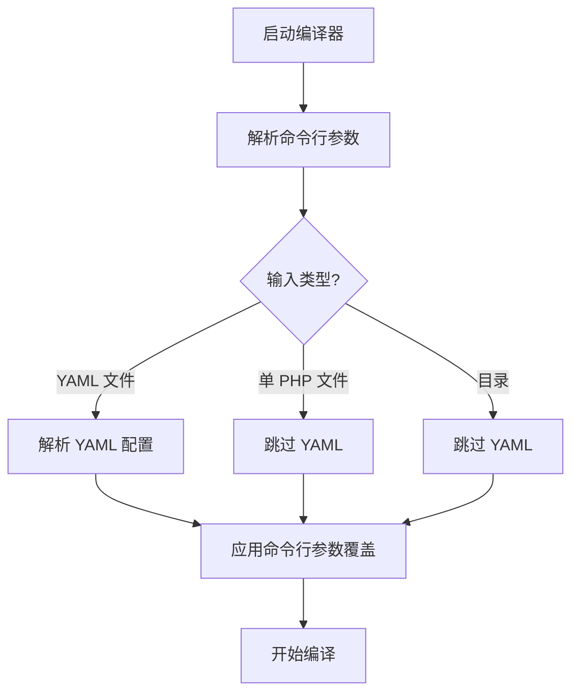

# 配置优先级规则说明

## 📋 概述

PHPX 编译器的配置遵循明确的优先级规则，确保用户可以灵活地控制编译行为。

---

## 🎯 优先级顺序（从高到低）

```
1. 命令行参数（最高优先级）
   ↓
2. YAML 配置文件
   ↓
3. 平台默认值（最低优先级）
```

---

## 💡 工作原理

### 执行流程



### 详细说明

1. **构造函数阶段**
   - 解析命令行参数
   - **不立即应用**到属性
   - 仅处理 `--help` 和 `--version`

2. **YAML 解析阶段**（仅当输入是 `.yml` 文件时）
   - 读取 `project.yml` 配置
   - 应用到编译器属性
   - 设置默认值

3. **命令行参数应用阶段**
   - 检查哪些命令行参数被定义
   - **覆盖** YAML 配置或默认值
   - 确保命令行参数优先级最高

---

## 📊 配置项示例

### 示例 1：C++ 标准版本

#### YAML 配置
```yaml
# project.yml
cxx-std: c++14
```

#### 命令行覆盖
```bash
php bin/compiler.php project.yml --cxx-std=c++17
```

#### 结果
✅ 使用 **c++17**（命令行优先级更高）

---

### 示例 2：构建模式

#### YAML 配置
```yaml
# project.yml
build-mode: bin
```

#### 命令行覆盖
```bash
php bin/compiler.php project.yml --mode=ext
```

#### 结果
✅ 使用 **ext**（命令行优先级更高）

---

### 示例 3：编译选项

#### YAML 配置
```yaml
# project.yml
cxx-flags:
  - -Wall
  - -O2
```

#### 命令行覆盖
```bash
php bin/compiler.php project.yml -O3
```

#### 结果
✅ 优化级别为 **3**（命令行优先级更高）
✅ cxx-flags 仍为 `-Wall -O2`（YAML 配置）

---

## 🔍 不同输入类型的处理

### 类型 1：YAML 配置文件

```bash
php bin/compiler.php project.yml --cxx-std=c++17
```

**执行流程：**
1. ✅ 解析 `project.yml`
2. ✅ 应用 YAML 中的配置
3. ✅ 用 `--cxx-std=c++17` 覆盖

**适用场景：**
- 大型项目
- 需要复杂配置
- 团队协作

---

### 类型 2：单个 PHP 文件

```bash
php bin/compiler.php hello.php --cxx-std=c++17 -O2
```

**执行流程：**
1. ❌ 跳过 YAML 解析
2. ✅ 直接应用命令行参数
3. ✅ 使用平台默认值作为基础

**适用场景：**
- 快速测试
- 简单脚本
- 临时编译

---

### 类型 3：目录

```bash
php bin/compiler.php src/ --mode=ext --cxx-std=c++17
```

**执行流程：**
1. ❌ 跳过 YAML 解析
2. ✅ 扫描目录中的所有 PHP 文件
3. ✅ 应用命令行参数
4. ✅ 使用平台默认值作为基础

**适用场景：**
- 批量编译
- 扩展模块
- 多文件项目

---

## 📝 完整示例

### 项目配置

```yaml
# project.yml
name: my-app
build-mode: bin
version: 1.0.0

cxx-std: c++14

cxx-flags:
  - -Wall
  - -Wextra

ld-flags:
  - -lm

sources:
  - src/main.php
  - src/utils.php
```

### 场景 1：使用默认配置

```bash
php bin/compiler.php project.yml
```

**结果：**
- cxx-std: **c++14**（来自 YAML）
- build-mode: **bin**（来自 YAML）
- cxx-flags: **-Wall -Wextra**（来自 YAML）

---

### 场景 2：部分覆盖

```bash
php bin/compiler.php project.yml --cxx-std=c++17
```

**结果：**
- cxx-std: **c++17**（命令行覆盖）
- build-mode: **bin**（来自 YAML）
- cxx-flags: **-Wall -Wextra**（来自 YAML）

---

### 场景 3：完全覆盖

```bash
php bin/compiler.php project.yml --cxx-std=c++20 --mode=ext -O3
```

**结果：**
- cxx-std: **c++20**（命令行覆盖）
- build-mode: **ext**（命令行覆盖）
- optimize-level: **3**（命令行覆盖）
- cxx-flags: **-Wall -Wextra**（来自 YAML，未被覆盖）

---

### 场景 4：单文件编译

```bash
php bin/compiler.php test.php --cxx-std=c++17 -O2
```

**结果：**
- cxx-std: **c++17**（命令行）
- build-mode: **bin**（默认值）
- optimize-level: **2**（命令行）
- 无 YAML 配置

---

## ⚙️ 支持的配置项

### 可从 YAML 读取的配置

| 配置项 | YAML 键 | 命令行参数 | 说明 |
|--------|---------|-----------|------|
| 项目名称 | `name` | `--output` | 输出文件名 |
| 构建模式 | `build-mode` / `type` | `--mode` | bin 或 ext |
| C++ 标准 | `cxx-std` | `--cxx-std` | c++14/17/20 |
| 编译选项 | `cxx-flags` | - | C++ 编译标志 |
| 链接选项 | `ld-flags` | - | 链接器标志 |
| 源文件 | `sources` | - | 源文件列表 |
| 忽略列表 | `ignore` | - | 忽略的文件 |

### 只能从命令行设置的配置

| 配置项 | 命令行参数 | 说明 |
|--------|-----------|------|
| 优化级别 | `-O <level>` | 0-3 |
| 调试信息 | `--debug` | 启用调试 |
| 性能分析 | `--profile` | 启用 profiling |
| Sanitizer | `--sanitize` | 内存检测 |
| 并行任务 | `-j <num>` | 并行编译数 |
| 隐藏控制台 | `--no-console` | Windows GUI |

---

## 🎨 最佳实践

### 1. YAML 中设置默认值

```yaml
# project.yml - 团队共享的默认配置
name: my-app
build-mode: bin
cxx-std: c++17

cxx-flags:
  - -Wall
  - -Wextra
```

---

### 2. 命令行用于临时覆盖

```bash
# 开发时使用调试模式
php bin/compiler.php project.yml --debug

# 发布时使用优化
php bin/compiler.php project.yml -O3

# 测试不同的 C++ 标准
php bin/compiler.php project.yml --cxx-std=c++20
```

---

### 3. 单文件快速测试

```bash
# 不需要 YAML，直接编译
php bin/compiler.php test.php -O2 --cxx-std=c++17
```

---

## 🐛 常见问题

### Q1: 为什么命令行参数没有生效？

A: 确保使用了正确的参数名称：

```bash
# ✅ 正确
php bin/compiler.php project.yml --cxx-std=c++17

# ❌ 错误（参数名不对）
php bin/compiler.php project.yml --cxx_std=c++17
```

---

### Q2: YAML 和命令行都设置了同一个值，哪个生效？

A: **命令行参数始终优先**。

```yaml
# project.yml
cxx-std: c++14
```

```bash
php bin/compiler.php project.yml --cxx-std=c++17
# 结果：使用 c++17
```

---

### Q3: 可以在 YAML 中设置优化级别吗？

A: 目前不支持。优化级别只能通过命令行设置：

```bash
php bin/compiler.php project.yml -O2
```

---

### Q4: 如何查看当前使用的配置？

A: 编译时会显示相关信息：

```
prepare: project.yml
...
C++ standard: c++17
Build mode: bin
Optimization: O2
...
```

---

## 📚 技术实现

### 代码位置

**Translator.php:**

```php
// 1. 构造函数：解析但不应用
public function __construct(string $rootPath)
{
    $this->climate->arguments->parse();
    // 不立即应用参数
}

// 2. YAML 解析：应用配置
protected function parseProjectYaml(string $path): array
{
    // 读取 YAML 并应用到属性
    $this->cxxStd = $cfg['cxx-std'] ?? 'c++17';
    $this->buildMode = $cfg['build-mode'] ?? 'bin';
    // ...
}

// 3. 应用命令行：覆盖配置
protected function applyCommandLineArguments(): void
{
    if ($this->climate->arguments->defined('cxx-std')) {
        $this->cxxStd = $this->climate->arguments->get('cxx-std');
    }
    // ...
}

// 4. getFiles：控制流程
public function getFiles(string $path): array
{
    if (is_yml($path)) {
        $this->parseProjectYaml($path);      // 先 YAML
        $this->applyCommandLineArguments();   // 后命令行
    } else {
        $this->applyCommandLineArguments();   // 直接命令行
    }
}
```

---

## 🎉 总结

### 核心原则

1. ✅ **命令行参数优先级最高** - 用户可以随时覆盖
2. ✅ **YAML 提供默认值** - 简化日常使用
3. ✅ **平台默认值兜底** - 确保总能运行
4. ✅ **清晰的执行顺序** - 易于理解和调试

### 优先级图示

```
用户意图
   ↓
命令行参数 ────────→ 最高优先级，立即生效
   ↓
YAML 配置 ─────────→ 中等优先级，提供默认值
   ↓
平台默认值 ────────→ 最低优先级，保证可用性
```

遵循这些规则，您可以灵活地控制编译行为！
